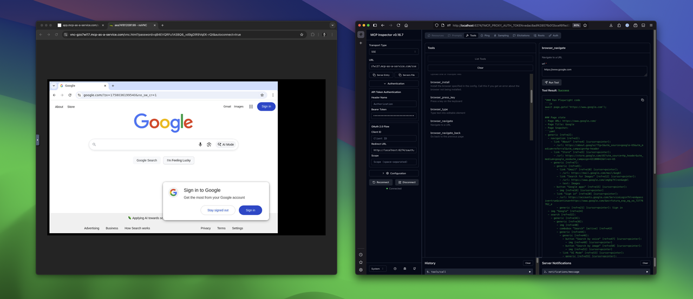

## Introduction & Context

With growing usage, a single “one size fits all” instance profile started to show its limits. Different workloads benefit from different trade‑offs, and operationally we needed a clearer separation of concerns between “what should run” and “how it is run”.

This release introduces **Multiple Instance Types**. It adds user‑visible improvements and lays technical groundwork that lets us evolve safely and quickly.

It also marks a concrete step toward the broader goal of MCP as a Service: offering a reliable, secure way to run many different MCP server flavors without thinking about infrastructure. We’re starting with two types — Playwright and a Linux command‑line profile — and will expand the catalog steadily.

## What’s New for You

### Choose the right instance type
When creating an MCP server, you can select from multiple instance types tailored to distinct needs as we roll them out.

_Instances overview: launch a Playwright browser‑based MCP server or a Linux command‑line MCP server with one click._

### Extended Admin UI
Cleaner flows on the instances screen reduce friction for common tasks.

### One‑click Recreate
Rebuild an instance in a single step for fast recovery or clean resets.

### Auto‑connecting VNC viewer
The embedded viewer connects automatically as soon as the instance is ready.

### Type‑aligned health signals
Readiness is checked according to the selected instance type, improving accuracy.

_Health checks reflect type‑specific readiness criteria and surface clearly on the details page._

#### Playwright: real browser automation
Use a full Chrome‑backed environment where agents can interact with the web like a user—navigate, click, type, and observe.

_The Playwright instance drives a real browser—ideal for end‑to‑end and agent workflows._

#### Linux Command Line: headless workflows
Run commands in a clean, isolated shell for data processing, scripting, or lightweight automation—without managing any servers.

_The Linux CLI instance focuses on fast, reproducible command execution._

## Implementation Details (for Engineers)

The interesting work is in the structure rather than in surface features. Three areas matter the most:

### 1) Instance type registry and config‑driven health
We introduced a small registry where each type declares image/build, required services, and health probes. Readiness checks are now driven by type configuration instead of ad‑hoc conditionals. This makes behavior explicit and localized.

### 2) Decoupling of domain decisions and execution
We separated “instance and lifecycle decisions” from “process execution and container orchestration”. This clarifies responsibilities and improves testability.

### 3) Split of instance management vs. configuration modules
Instance lifecycle and configuration live in dedicated modules. Changes to one area no longer ripple through the other.

There is also groundwork for additional profiles (e.g., a Linux command‑line oriented type) and small UX improvements such as the VNC viewer’s auto‑connect.

## Operational Flow (at a glance)

1. A user selects an instance type and creates an instance.
2. The platform resolves the type through the registry and materializes the correct container setup.
3. Health checks are sourced from the type config and reported in the UI.
4. VNC auto‑connects when the health state flips to ready.

## Change Reference

The work shipped in the following changeset:

- [Feature: Multiple Instance Types](https://github.com/dx-tooling/maas-webapp/pull/6)

## Closing Notes

Multiple Instance Types is a foundation. It lets us introduce specialized environments (browser‑centric, headless/CLI‑focused, and more) with clear, type‑specific contracts for health, routing, and resources—without scattering logic.

Feedback is welcome. Tell us which types would be most useful for your workflows.

## Background Reading

If you want the broader context on why we use containers and Traefik, these earlier posts provide the foundation:

- [Platform Rewrite: Switching from OS processes to Docker containers](2025-08-24-docker-rewrite.html)
- [MCP as a Service Just Got Better](2025-08-25-mcp-as-a-service-improvements.html)
- [Fixing "Moved Permanently" on MCP instance endpoints](2025-08-30-instances-redirect-fix.html)

## Looking Ahead

Expect more instance types over time. The structure put in place here is designed to scale the catalog without adding operational complexity.

